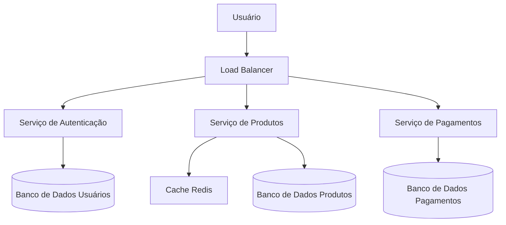
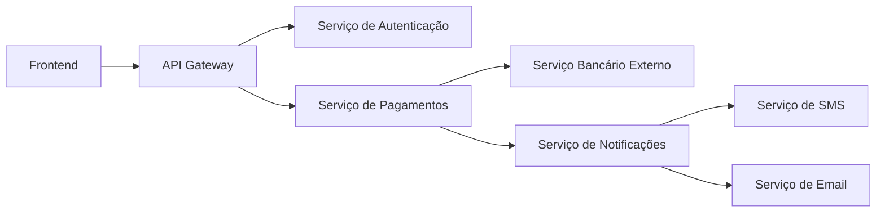

# arquitetura-software
Conceitos básicos de arquitetura de software.

# Arquiteturas em Grande Escala e Arquiteturas Complexas

## 1. O que são **Large-Scale Architectures**?

Arquiteturas em **grande escala** referem-se ao design de sistemas capazes de lidar com:

- **Milhões de usuários simultâneos**  
- **Altos volumes de dados**  
- **Escalabilidade horizontal** (adicionar servidores para aumentar capacidade)  
- **Disponibilidade global e alta confiabilidade**  

Essas arquiteturas aparecem em sistemas como:

- Redes sociais (Facebook, Twitter)  
- Plataformas de streaming (Netflix, Spotify)  
- E-commerces de grande porte (Amazon, Mercado Livre)  

### Características principais:

- **Microservices**: divisão do sistema em serviços menores e independentes  
- **Load Balancers**: distribuem requisições entre múltiplos servidores  
- **Cache distribuído**: Redis, Memcached ou CDN para reduzir latência  
- **Bancos de dados distribuídos**: Cassandra, DynamoDB, CockroachDB  
- **Alta disponibilidade**: replicação de dados, failover automático  

### Exemplo em diagrama:

## 2. O que são **Complex Architectures**?

Arquiteturas **complexas** são aquelas em que a **interconexão entre componentes** cria dificuldades de:

- **Manutenção**  
- **Evolução do sistema**  
- **Entendimento da lógica de negócios**  

Um sistema pode ser **grande** mas **não necessariamente complexo** se for bem projetado.  
A **complexidade surge** quando há:

- **Dependências excessivas entre módulos**  
- **Regras de negócio distribuídas em vários lugares**  
- **Integração com múltiplos sistemas externos**  
- **Camadas de abstração demais ou mal planejadas**  

### Exemplos de complexidade:
- Uma API que depende de 5 outros serviços externos para responder.  
- Código com **forte acoplamento**, em que mudar um módulo quebra outros.  
- Sistemas legados com camadas mal documentadas.  

### Exemplo em diagrama:

## 3. Diferenças entre Large-Scale e Complex

| Aspecto               | Large-Scale (Grande Escala)                     | Complex (Complexa)                            |
|------------------------|-----------------------------------------------|-----------------------------------------------|
| **Foco**              | Escalabilidade, performance, alta disponibilidade | Estrutura, dependências e organização interna |
| **Problema principal** | Como atender milhões de usuários               | Como manter e evoluir o sistema sem perder controle |
| **Exemplo real**       | Netflix suportando bilhões de streams/dia     | Sistema bancário com dezenas de integrações legadas |
| **Solução comum**      | Microservices, balanceadores, sharding        | Refatoração, design patterns, Domain-Driven Design (DDD) |

---

## 4. Boas práticas para lidar com ambos

✅ **Em Large-Scale**:  
- Usar **infraestrutura na nuvem** (AWS, GCP, Azure)  
- Projetar para **resiliência** (retry, circuit breaker, replicação)  
- Monitoramento e observabilidade (Prometheus, Grafana, ELK)  

✅ **Em Complex Architectures**:  
- **Domain-Driven Design (DDD)** → organiza a lógica de negócio  
- **Event-driven architecture** → desacopla serviços  
- **Documentação clara** e diagramas de dependência  
- **Automatizar testes e CI/CD**
---

# 7 Princípios de Sucesso de uma Arquitetura de Software

Para que uma arquitetura de software seja eficaz, escalável e sustentável, existem 7 princípios fundamentais que devem ser seguidos. Estes princípios ajudam equipes a planejar, operar e evoluir sistemas complexos com segurança e eficiência.

---

## 1. **Planejamento de Capacidade (Capacity Planning)**
Garantir que o sistema suporte a demanda atual e futura.  
- Avaliar **recursos de CPU, memória, rede e armazenamento**  
- Planejar **escala horizontal ou vertical** conforme crescimento esperado  
- Evitar **sobrecarga ou desperdício de recursos**  

---

## 2. **Observabilidade (Observability)**
Permite entender o comportamento do sistema em produção.  
- Implementar **logs estruturados, métricas e tracing distribuído**  
- Usar ferramentas como **Prometheus, Grafana, ELK Stack, Jaeger**  
- Facilita **detecção de problemas antes que impactem usuários**

---

## 3. **Release Engineering**
Gerenciar e automatizar processos de entrega de software.  
- Implementar **CI/CD** para integração e deploy contínuo  
- Garantir **versionamento, rollback e testes automatizados**  
- Reduzir riscos de **falhas em produção**

---

## 4. **Operações (Operations)**
Planejar como o sistema será mantido e operado no dia a dia.  
- Monitorar **disponibilidade, desempenho e uso de recursos**  
- Ter **playbooks e automações** para tarefas repetitivas  
- Garantir **tempo de resposta rápido para incidentes**

---

## 5. **Confiabilidade (Reliability)**
Garantir que o sistema funcione corretamente mesmo diante de falhas.  
- Estratégias: **replicação, failover, circuit breakers, retries**  
- Minimizar **pontos únicos de falha**  
- Aumentar **confiança do usuário no sistema**

---

## 6. **Otimização de Custo (Cost Optimization)**
Gerenciar recursos de forma eficiente sem comprometer performance.  
- Escolher **infraestrutura sob demanda ou escalável automaticamente**  
- Evitar **recursos ociosos**  
- Avaliar **trade-offs entre custo, performance e disponibilidade**

---

## 7. **Segurança (Security)**
Proteger o sistema contra ameaças e vulnerabilidades.  
- Implementar **autenticação e autorização robustas**  
- Garantir **criptografia de dados em trânsito e em repouso**  
- Monitorar **ameaças e aplicar correções regularmente**  

---

Seguindo estes princípios, uma arquitetura de software se torna **resiliente, escalável e sustentável**, permitindo que equipes entreguem valor contínuo com **alta confiabilidade e segurança**.

