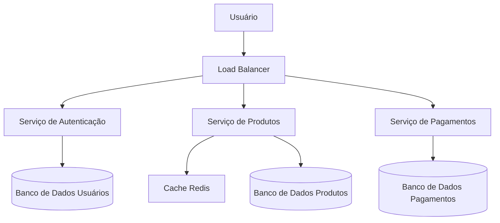
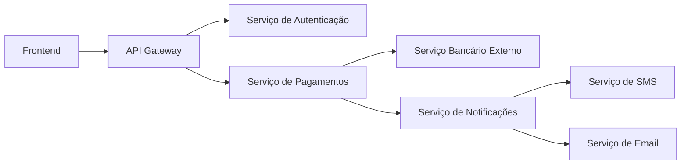

# arquitetura-software
Conceitos básicos de arquitetura de software.

# Arquiteturas em Grande Escala e Arquiteturas Complexas

## 1. O que são **Large-Scale Architectures**?

Arquiteturas em **grande escala** referem-se ao design de sistemas capazes de lidar com:

- **Milhões de usuários simultâneos**  
- **Altos volumes de dados**  
- **Escalabilidade horizontal** (adicionar servidores para aumentar capacidade)  
- **Disponibilidade global e alta confiabilidade**  

Essas arquiteturas aparecem em sistemas como:

- Redes sociais (Facebook, Twitter)  
- Plataformas de streaming (Netflix, Spotify)  
- E-commerces de grande porte (Amazon, Mercado Livre)  

### Características principais:

- **Microservices**: divisão do sistema em serviços menores e independentes  
- **Load Balancers**: distribuem requisições entre múltiplos servidores  
- **Cache distribuído**: Redis, Memcached ou CDN para reduzir latência  
- **Bancos de dados distribuídos**: Cassandra, DynamoDB, CockroachDB  
- **Alta disponibilidade**: replicação de dados, failover automático  

### Exemplo em diagrama:

## 2. O que são **Complex Architectures**?

Arquiteturas **complexas** são aquelas em que a **interconexão entre componentes** cria dificuldades de:

- **Manutenção**  
- **Evolução do sistema**  
- **Entendimento da lógica de negócios**  

Um sistema pode ser **grande** mas **não necessariamente complexo** se for bem projetado.  
A **complexidade surge** quando há:

- **Dependências excessivas entre módulos**  
- **Regras de negócio distribuídas em vários lugares**  
- **Integração com múltiplos sistemas externos**  
- **Camadas de abstração demais ou mal planejadas**  

### Exemplos de complexidade:
- Uma API que depende de 5 outros serviços externos para responder.  
- Código com **forte acoplamento**, em que mudar um módulo quebra outros.  
- Sistemas legados com camadas mal documentadas.  

### Exemplo em diagrama:

## 3. Diferenças entre Large-Scale e Complex

| Aspecto               | Large-Scale (Grande Escala)                     | Complex (Complexa)                            |
|------------------------|-----------------------------------------------|-----------------------------------------------|
| **Foco**              | Escalabilidade, performance, alta disponibilidade | Estrutura, dependências e organização interna |
| **Problema principal** | Como atender milhões de usuários               | Como manter e evoluir o sistema sem perder controle |
| **Exemplo real**       | Netflix suportando bilhões de streams/dia     | Sistema bancário com dezenas de integrações legadas |
| **Solução comum**      | Microservices, balanceadores, sharding        | Refatoração, design patterns, Domain-Driven Design (DDD) |

---

## 4. Boas práticas para lidar com ambos

✅ **Em Large-Scale**:  
- Usar **infraestrutura na nuvem** (AWS, GCP, Azure)  
- Projetar para **resiliência** (retry, circuit breaker, replicação)  
- Monitoramento e observabilidade (Prometheus, Grafana, ELK)  

✅ **Em Complex Architectures**:  
- **Domain-Driven Design (DDD)** → organiza a lógica de negócio  
- **Event-driven architecture** → desacopla serviços  
- **Documentação clara** e diagramas de dependência  
- **Automatizar testes e CI/CD**
---

# 7 Princípios de Sucesso de uma Arquitetura de Software

Para que uma arquitetura de software seja eficaz, escalável e sustentável, existem 7 princípios fundamentais que devem ser seguidos. Estes princípios ajudam equipes a planejar, operar e evoluir sistemas complexos com segurança e eficiência.

---

## 1. **Planejamento de Capacidade (Capacity Planning)**
Garantir que o sistema suporte a demanda atual e futura.  
- Avaliar **recursos de CPU, memória, rede e armazenamento**  
- Planejar **escala horizontal ou vertical** conforme crescimento esperado  
- Evitar **sobrecarga ou desperdício de recursos**  

---

## 2. **Observabilidade (Observability)**
Permite entender o comportamento do sistema em produção.  
- Implementar **logs estruturados, métricas e tracing distribuído**  
- Usar ferramentas como **Prometheus, Grafana, ELK Stack, Jaeger**  
- Facilita **detecção de problemas antes que impactem usuários**

---

## 3. **Release Engineering**
Gerenciar e automatizar processos de entrega de software.  
- Implementar **CI/CD** para integração e deploy contínuo  
- Garantir **versionamento, rollback e testes automatizados**  
- Reduzir riscos de **falhas em produção**

---

## 4. **Operações (Operations)**
Planejar como o sistema será mantido e operado no dia a dia.  
- Monitorar **disponibilidade, desempenho e uso de recursos**  
- Ter **playbooks e automações** para tarefas repetitivas  
- Garantir **tempo de resposta rápido para incidentes**

---

## 5. **Confiabilidade (Reliability)**
Garantir que o sistema funcione corretamente mesmo diante de falhas.  
- Estratégias: **replicação, failover, circuit breakers, retries**  
- Minimizar **pontos únicos de falha**  
- Aumentar **confiança do usuário no sistema**

A confiabilidade pode ser detalhada em cinco aspectos principais:

### 5.1 Consistência
- Todos os nós do sistema veem os mesmos dados ao mesmo tempo  
- Evita **conflitos e leituras incorretas**

### 5.2 Disponibilidade
- O sistema responde a todas as requisições dentro de um tempo aceitável  
- Maximiza **tempo de atividade (uptime)**

### 5.3 Durabilidade
- Dados não se perdem após serem gravados, mesmo em falhas  
- Estratégias: **replicação, backup e armazenamento persistente confiável**

### 5.4 Tolerância a Falhas (Fault Tolerance)
- O sistema continua operando mesmo que um ou mais componentes falhem  
- Estratégias: **failover automático, retries, circuit breakers**

### 5.5 Previsibilidade
- O comportamento do sistema é consistente e previsível sob diferentes cargas  
- Permite **planejamento de capacidade e confiabilidade operacional**

---

## 6. **Otimização de Custo (Cost Optimization)**
Gerenciar recursos de forma eficiente sem comprometer performance.  
- Escolher **infraestrutura sob demanda ou escalável automaticamente**  
- Evitar **recursos ociosos**  
- Avaliar **trade-offs entre custo, performance e disponibilidade**

---

## 7. **Segurança (Security)**
Proteger o sistema contra ameaças e vulnerabilidades.  
- Implementar **autenticação e autorização robustas**  
- Garantir **criptografia de dados em trânsito e em repouso**  
- Monitorar **ameaças e aplicar correções regularmente**  

---

Seguindo estes princípios, uma arquitetura de software se torna **resiliente, escalável e sustentável**, permitindo que equipes entreguem valor contínuo com **alta confiabilidade e segurança**.

---

# Objectives and Key Results (OKR)

**Objectives and Key Results (OKR)** é uma metodologia de definição de metas usada por empresas para alinhar objetivos estratégicos com resultados mensuráveis. Ela ajuda equipes e organizações a focarem no que realmente importa, mantendo transparência e motivação.

---

## 1. Estrutura de OKR

Um OKR é composto por duas partes:

### 1.1 **Objective (Objetivo)**
- Um objetivo é **qualitativo e inspirador**  
- Responde à pergunta: "O que queremos alcançar?"  
- Deve ser **claro, motivador e alcançável**  

### 1.2 **Key Results (Resultados-Chave)**
- Resultados mensuráveis que indicam se o objetivo foi atingido  
- Normalmente **quantitativos**  
- Cada objetivo costuma ter **2 a 5 key results**  

---

## 2. Exemplo Prático: Melhorar a Satisfação do Cliente

### Objetivo
**Melhorar a satisfação do cliente em nossos produtos e serviços até o final do trimestre.**

### Key Results
1. Aumentar a **pontuação média de satisfação (NPS)** de 65 para 80  
2. Reduzir o **tempo médio de resposta do suporte** de 24h para 12h  
3. Implementar **3 novas funcionalidades** solicitadas diretamente pelos clientes  
4. Reduzir a **taxa de reclamações** em 30%  

> Nesse exemplo, o objetivo é qualitativo e inspirador (“melhorar a satisfação do cliente”), enquanto os key results são métricas claras que indicam o progresso rumo ao objetivo.  

---

## 3. Boas Práticas com OKRs

- Definir **OKRs trimestrais** ou semestrais  
- Tornar os objetivos **ambiciosos, mas alcançáveis**  
- Alinhar OKRs entre **equipes e níveis da empresa**  
- Revisar regularmente e ajustar conforme necessário  
- Garantir que **cada resultado-chave seja mensurável**  

---

## 4. Benefícios do OKR

- Foco em resultados e não apenas em atividades  
- Maior alinhamento entre equipes e objetivos estratégicos  
- Transparência e visibilidade do progresso  
- Motivação da equipe ao ver resultados concretos

---

# Alinhamento entre Arquitetura de Software e Metas de Negócio

Uma arquitetura de software ideal não é apenas **robusta e escalável**, mas também deve ser **prática e alinhada com os objetivos de negócio**. Em muitos casos, mudanças radicais na arquitetura — como migrar de um banco de dados ou refatorar todo um sistema — podem **não ser viáveis** devido a restrições de tempo, custo ou prioridades estratégicas.

---

## 1. Equilíbrio entre Flexibilidade e Negócio

### Desafios comuns:
- Necessidade de atender **metas de negócio imediatas**, como lançamento de funcionalidades ou aumento de receita  
- Restrições orçamentárias e de equipe  
- Sistemas legados que **não permitem mudanças radicais** sem impactar usuários  

### Consequências de não considerar o negócio:
- Focar apenas na “arquitetura perfeita” pode atrasar entregas importantes  
- Projetos podem se tornar **ineficientes ou obsoletos** frente às demandas reais do mercado  

---

## 2. Estratégias de Equilíbrio

1. **Planejamento incremental**
   - Introduzir melhorias de arquitetura **de forma gradual**  
   - Exemplo: adicionar cache ou otimizações de queries antes de migrar de banco de dados

2. **Foco em objetivos de negócio**
   - Priorizar mudanças que **gerem valor tangível** para clientes e stakeholders  
   - Exemplo: melhorar tempo de resposta de funcionalidades críticas antes de mudar toda a stack

3. **Arquitetura evolutiva**
   - Projetar componentes que permitam **futuras alterações sem reescrever todo o sistema**  
   - Exemplo: usar interfaces e abstrações para isolar dependências críticas

4. **Comunicação com equipes de negócio**
   - Alinhar prioridades técnicas com **OKRs ou metas estratégicas da empresa**  
   - Garantir que decisões técnicas suportem os objetivos de negócio sem atrasar entregas

---

## 3. Exemplo prático

- **Situação:** A equipe de negócios quer aumentar a satisfação do cliente adicionando novas funcionalidades ao sistema de e-commerce.  
- **Desafio arquitetural:** Migrar todo o banco de dados para uma solução mais moderna demandaria 3 meses de trabalho e afetaria lançamentos importantes.  
- **Solução equilibrada:**  
  - Priorizar funcionalidades que agreguem valor imediato  
  - Aplicar pequenas melhorias na arquitetura atual (ex.: otimizações de queries e cache)  
  - Planejar migração de banco de dados para uma fase futura, quando houver menor impacto nas metas  

> Esse equilíbrio garante que o sistema evolua de forma segura, mas sem comprometer **as metas e necessidades do negócio**.

---

## 4. Conclusão

Uma boa arquitetura de software **não deve ser perfeita no papel**, mas sim **eficaz na prática**, conciliando:

- Robustez e confiabilidade técnicas  
- Flexibilidade para futuras melhorias  
- Entrega de valor real para o negócio  

A chave está em **priorizar decisões arquiteturais que suportem metas estratégicas**, garantindo que o sistema evolua sem comprometer objetivos imediatos.

