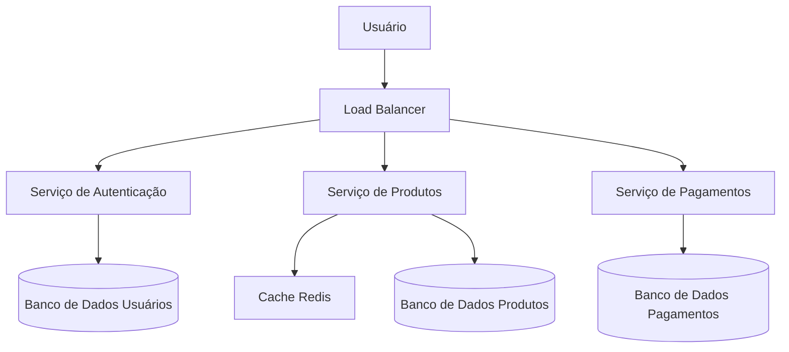
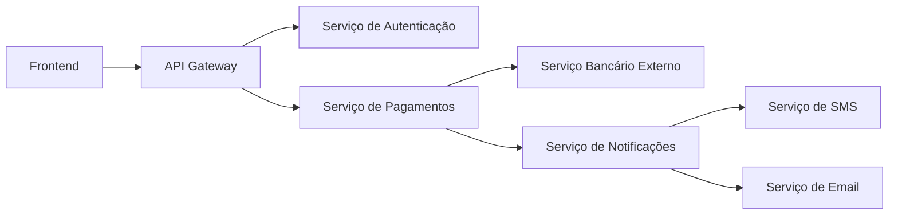

# arquitetura-software
Conceitos básicos de arquitetura de software.

# Arquiteturas em Grande Escala e Arquiteturas Complexas

## 1. O que são **Large-Scale Architectures**?

Arquiteturas em **grande escala** referem-se ao design de sistemas capazes de lidar com:

- **Milhões de usuários simultâneos**  
- **Altos volumes de dados**  
- **Escalabilidade horizontal** (adicionar servidores para aumentar capacidade)  
- **Disponibilidade global e alta confiabilidade**  

Essas arquiteturas aparecem em sistemas como:

- Redes sociais (Facebook, Twitter)  
- Plataformas de streaming (Netflix, Spotify)  
- E-commerces de grande porte (Amazon, Mercado Livre)  

### Características principais:

- **Microservices**: divisão do sistema em serviços menores e independentes  
- **Load Balancers**: distribuem requisições entre múltiplos servidores  
- **Cache distribuído**: Redis, Memcached ou CDN para reduzir latência  
- **Bancos de dados distribuídos**: Cassandra, DynamoDB, CockroachDB  
- **Alta disponibilidade**: replicação de dados, failover automático  

### Exemplo em diagrama:



## 2. O que são **Complex Architectures**?

Arquiteturas **complexas** são aquelas em que a **interconexão entre componentes** cria dificuldades de:

- **Manutenção**  
- **Evolução do sistema**  
- **Entendimento da lógica de negócios**  

Um sistema pode ser **grande** mas **não necessariamente complexo** se for bem projetado.  
A **complexidade surge** quando há:

- **Dependências excessivas entre módulos**  
- **Regras de negócio distribuídas em vários lugares**  
- **Integração com múltiplos sistemas externos**  
- **Camadas de abstração demais ou mal planejadas**  

### Exemplos de complexidade:
- Uma API que depende de 5 outros serviços externos para responder.  
- Código com **forte acoplamento**, em que mudar um módulo quebra outros.  
- Sistemas legados com camadas mal documentadas.  

### Exemplo em diagrama:


## 3. Diferenças entre Large-Scale e Complex

| Aspecto               | Large-Scale (Grande Escala)                     | Complex (Complexa)                            |
|------------------------|-----------------------------------------------|-----------------------------------------------|
| **Foco**              | Escalabilidade, performance, alta disponibilidade | Estrutura, dependências e organização interna |
| **Problema principal** | Como atender milhões de usuários               | Como manter e evoluir o sistema sem perder controle |
| **Exemplo real**       | Netflix suportando bilhões de streams/dia     | Sistema bancário com dezenas de integrações legadas |
| **Solução comum**      | Microservices, balanceadores, sharding        | Refatoração, design patterns, Domain-Driven Design (DDD) |

---

## 4. Boas práticas para lidar com ambos

✅ **Em Large-Scale**:  
- Usar **infraestrutura na nuvem** (AWS, GCP, Azure)  
- Projetar para **resiliência** (retry, circuit breaker, replicação)  
- Monitoramento e observabilidade (Prometheus, Grafana, ELK)  

✅ **Em Complex Architectures**:  
- **Domain-Driven Design (DDD)** → organiza a lógica de negócio  
- **Event-driven architecture** → desacopla serviços  
- **Documentação clara** e diagramas de dependência  
- **Automatizar testes e CI/CD**
---

# 7 Princípios de Sucesso de uma Arquitetura de Software

Para que uma arquitetura de software seja eficaz, escalável e sustentável, existem 7 princípios fundamentais que devem ser seguidos. Estes princípios ajudam equipes a planejar, operar e evoluir sistemas complexos com segurança e eficiência.

---

## 1. **Planejamento de Capacidade (Capacity Planning)**
Garantir que o sistema suporte a demanda atual e futura.  
- Avaliar **recursos de CPU, memória, rede e armazenamento**  
- Planejar **escala horizontal ou vertical** conforme crescimento esperado  
- Evitar **sobrecarga ou desperdício de recursos**  

---

## 2. **Observabilidade (Observability)**
Permite entender o comportamento do sistema em produção.  
- Implementar **logs estruturados, métricas e tracing distribuído**  
- Usar ferramentas como **Prometheus, Grafana, ELK Stack, Jaeger**  
- Facilita **detecção de problemas antes que impactem usuários**

---

## 3. **Release Engineering**
Gerenciar e automatizar processos de entrega de software.  
- Implementar **CI/CD** para integração e deploy contínuo  
- Garantir **versionamento, rollback e testes automatizados**  
- Reduzir riscos de **falhas em produção**

---

## 4. **Operações (Operations)**
Planejar como o sistema será mantido e operado no dia a dia.  
- Monitorar **disponibilidade, desempenho e uso de recursos**  
- Ter **playbooks e automações** para tarefas repetitivas  
- Garantir **tempo de resposta rápido para incidentes**

---

## 5. **Confiabilidade (Reliability)**
Garantir que o sistema funcione corretamente mesmo diante de falhas.  
- Estratégias: **replicação, failover, circuit breakers, retries**  
- Minimizar **pontos únicos de falha**  
- Aumentar **confiança do usuário no sistema**

A confiabilidade pode ser detalhada em cinco aspectos principais:

### 5.1 Consistência
- Todos os nós do sistema veem os mesmos dados ao mesmo tempo  
- Evita **conflitos e leituras incorretas**

### 5.2 Disponibilidade
- O sistema responde a todas as requisições dentro de um tempo aceitável  
- Maximiza **tempo de atividade (uptime)**

### 5.3 Durabilidade
- Dados não se perdem após serem gravados, mesmo em falhas  
- Estratégias: **replicação, backup e armazenamento persistente confiável**

### 5.4 Tolerância a Falhas (Fault Tolerance)
- O sistema continua operando mesmo que um ou mais componentes falhem  
- Estratégias: **failover automático, retries, circuit breakers**

### 5.5 Previsibilidade
- O comportamento do sistema é consistente e previsível sob diferentes cargas  
- Permite **planejamento de capacidade e confiabilidade operacional**

---

## 6. **Otimização de Custo (Cost Optimization)**
Gerenciar recursos de forma eficiente sem comprometer performance.  
- Escolher **infraestrutura sob demanda ou escalável automaticamente**  
- Evitar **recursos ociosos**  
- Avaliar **trade-offs entre custo, performance e disponibilidade**

---

## 7. **Segurança (Security)**
Proteger o sistema contra ameaças e vulnerabilidades.  
- Implementar **autenticação e autorização robustas**  
- Garantir **criptografia de dados em trânsito e em repouso**  
- Monitorar **ameaças e aplicar correções regularmente**  

---

Seguindo estes princípios, uma arquitetura de software se torna **resiliente, escalável e sustentável**, permitindo que equipes entreguem valor contínuo com **alta confiabilidade e segurança**.

---

# Objectives and Key Results (OKR)

**Objectives and Key Results (OKR)** é uma metodologia de definição de metas usada por empresas para alinhar objetivos estratégicos com resultados mensuráveis. Ela ajuda equipes e organizações a focarem no que realmente importa, mantendo transparência e motivação.

---

## 1. Estrutura de OKR

Um OKR é composto por duas partes:

### 1.1 **Objective (Objetivo)**
- Um objetivo é **qualitativo e inspirador**  
- Responde à pergunta: "O que queremos alcançar?"  
- Deve ser **claro, motivador e alcançável**  

### 1.2 **Key Results (Resultados-Chave)**
- Resultados mensuráveis que indicam se o objetivo foi atingido  
- Normalmente **quantitativos**  
- Cada objetivo costuma ter **2 a 5 key results**  

---

## 2. Exemplo Prático: Melhorar a Satisfação do Cliente

### Objetivo
**Melhorar a satisfação do cliente em nossos produtos e serviços até o final do trimestre.**

### Key Results
1. Aumentar a **pontuação média de satisfação (NPS)** de 65 para 80  
2. Reduzir o **tempo médio de resposta do suporte** de 24h para 12h  
3. Implementar **3 novas funcionalidades** solicitadas diretamente pelos clientes  
4. Reduzir a **taxa de reclamações** em 30%  

> Nesse exemplo, o objetivo é qualitativo e inspirador (“melhorar a satisfação do cliente”), enquanto os key results são métricas claras que indicam o progresso rumo ao objetivo.  

---

## 3. Boas Práticas com OKRs

- Definir **OKRs trimestrais** ou semestrais  
- Tornar os objetivos **ambiciosos, mas alcançáveis**  
- Alinhar OKRs entre **equipes e níveis da empresa**  
- Revisar regularmente e ajustar conforme necessário  
- Garantir que **cada resultado-chave seja mensurável**  

---

## 4. Benefícios do OKR

- Foco em resultados e não apenas em atividades  
- Maior alinhamento entre equipes e objetivos estratégicos  
- Transparência e visibilidade do progresso  
- Motivação da equipe ao ver resultados concretos

---

# Alinhamento entre Arquitetura de Software e Metas de Negócio

Uma arquitetura de software ideal não é apenas **robusta e escalável**, mas também deve ser **prática e alinhada com os objetivos de negócio**. Em muitos casos, mudanças radicais na arquitetura — como migrar de um banco de dados ou refatorar todo um sistema — podem **não ser viáveis** devido a restrições de tempo, custo ou prioridades estratégicas.

---

## 1. Equilíbrio entre Flexibilidade e Negócio

### Desafios comuns:
- Necessidade de atender **metas de negócio imediatas**, como lançamento de funcionalidades ou aumento de receita  
- Restrições orçamentárias e de equipe  
- Sistemas legados que **não permitem mudanças radicais** sem impactar usuários  

### Consequências de não considerar o negócio:
- Focar apenas na “arquitetura perfeita” pode atrasar entregas importantes  
- Projetos podem se tornar **ineficientes ou obsoletos** frente às demandas reais do mercado  

---

## 2. Estratégias de Equilíbrio

1. **Planejamento incremental**
   - Introduzir melhorias de arquitetura **de forma gradual**  
   - Exemplo: adicionar cache ou otimizações de queries antes de migrar de banco de dados

2. **Foco em objetivos de negócio**
   - Priorizar mudanças que **gerem valor tangível** para clientes e stakeholders  
   - Exemplo: melhorar tempo de resposta de funcionalidades críticas antes de mudar toda a stack

3. **Arquitetura evolutiva**
   - Projetar componentes que permitam **futuras alterações sem reescrever todo o sistema**  
   - Exemplo: usar interfaces e abstrações para isolar dependências críticas

4. **Comunicação com equipes de negócio**
   - Alinhar prioridades técnicas com **OKRs ou metas estratégicas da empresa**  
   - Garantir que decisões técnicas suportem os objetivos de negócio sem atrasar entregas

---

## 3. Exemplo prático

- **Situação:** A equipe de negócios quer aumentar a satisfação do cliente adicionando novas funcionalidades ao sistema de e-commerce.  
- **Desafio arquitetural:** Migrar todo o banco de dados para uma solução mais moderna demandaria 3 meses de trabalho e afetaria lançamentos importantes.  
- **Solução equilibrada:**  
  - Priorizar funcionalidades que agreguem valor imediato  
  - Aplicar pequenas melhorias na arquitetura atual (ex.: otimizações de queries e cache)  
  - Planejar migração de banco de dados para uma fase futura, quando houver menor impacto nas metas  

> Esse equilíbrio garante que o sistema evolua de forma segura, mas sem comprometer **as metas e necessidades do negócio**.

---

## 4. Conclusão

Uma boa arquitetura de software **não deve ser perfeita no papel**, mas sim **eficaz na prática**, conciliando:

- Robustez e confiabilidade técnicas  
- Flexibilidade para futuras melhorias  
- Entrega de valor real para o negócio  

A chave está em **priorizar decisões arquiteturais que suportem metas estratégicas**, garantindo que o sistema evolua sem comprometer objetivos imediatos.

---

# Ciclo de Mudança de Arquitetura

Mudanças em arquitetura de software não devem ser feitas de forma abrupta.  
É essencial seguir um ciclo estruturado que permita **avaliar riscos, validar hipóteses e garantir alinhamento com o negócio**.  

Abaixo está um ciclo recomendado:

---

## 1. Avaliação do **AS-IS** (Estado Atual)
- Levantar a arquitetura atual do sistema (diagramas, componentes, dependências).  
- Identificar gargalos, problemas técnicos e limitações.  
- Mapear custos, riscos e impacto nas operações.  

📌 Exemplo: Detectar que o banco relacional atual não suporta o volume de consultas necessárias.

---

## 2. Definição do **TO-BE** (Estado Futuro Desejado)
- Desenhar como a arquitetura deve ser no futuro, considerando:  
  - Escalabilidade  
  - Confiabilidade  
  - Segurança  
  - Alinhamento com objetivos de negócio  
- Criar diagramas e documentar a visão desejada.  

📌 Exemplo: Definir que a arquitetura futura será baseada em microservices com banco NoSQL distribuído.

---

## 3. Execução de **Prova de Conceito (POC)**
- Validar a viabilidade técnica de tecnologias ou abordagens.  
- Implementar um **protótipo limitado**, sem necessidade de cobrir todo o escopo.  
- Avaliar performance, integração e custo-benefício.  

📌 Exemplo: Testar o MongoDB em um módulo específico antes de migrar o sistema todo.

---

## 4. Planejamento da **Migração Oficial**
- Definir uma estratégia de transição (big bang ou incremental).  
- Avaliar riscos de downtime e criar planos de rollback.  
- Planejar fases da migração com entregas controladas.  

📌 Exemplo: Migrar primeiro os serviços de autenticação e relatórios, mantendo outros no banco antigo.

---

## 5. Testes e Validação
- Garantir que o sistema atende os requisitos funcionais e não funcionais.  
- Executar testes de:  
  - **Performance** (carga, stress, escalabilidade)  
  - **Confiabilidade** (failover, tolerância a falhas)  
  - **Segurança** (vulnerabilidades, acessos)  
- Monitorar métricas pós-migração para ajustes finos.  

📌 Exemplo: Simular picos de usuários e verificar se a nova arquitetura suporta a carga sem falhas.

---

## Fluxo em Diagrama

```mermaid
flowchart LR
    A[AS-IS<br>Estado Atual] --> B[TO-BE<br>Estado Futuro]
    B --> C[Prova de Conceito (POC)]
    C --> D[Migração Oficial]
    D --> E[Testes e Validação]
    E --> F[Arquitetura em Produção]
    
```

---

## 6. Conclusão 

O ciclo de mudança de arquitetura deve ser **iterativo e controlado**, sempre priorizando:

- **Redução de riscos**  
- **Entrega de valor ao negócio**  
- **Validação contínua**  

Assim, evita-se grandes falhas e garante-se que a evolução arquitetural **acompanhe as necessidades reais da empresa**, conciliando:

- Robustez e confiabilidade técnicas  
- Flexibilidade para futuras melhorias  
- Entrega de valor real para o negócio  

A chave está em **priorizar decisões arquiteturais que suportem metas estratégicas**, garantindo que o sistema evolua sem comprometer objetivos imediatos.

---

# High Availability (HA) vs Fault Tolerance (FT)

Ao projetar sistemas críticos, dois conceitos aparecem com frequência: **Alta Disponibilidade (High Availability)** e **Tolerância a Falhas (Fault Tolerance)**.  
Ambos buscam **reduzir indisponibilidade**, mas de formas diferentes e com **custos distintos**.

---

## 1. High Availability (HA) – Alta Disponibilidade

- **Definição:**  
  Capacidade de um sistema permanecer disponível mesmo diante de falhas parciais, **minimizando o tempo de inatividade**.

- **Como funciona:**  
  - Usa redundância (servidores em cluster, load balancers, réplicas).  
  - Em caso de falha, outro nó assume automaticamente.  
  - Pode haver uma **pequena interrupção** durante o failover.  

- **Exemplo:**  
  Um e-commerce distribuído em múltiplas zonas de disponibilidade (AWS AZs). Se um servidor cai, outro assume rapidamente.  

- **Cenários comuns:**  
  - Sites de vendas online  
  - Serviços de streaming  
  - Aplicações SaaS  

---

## 2. Fault Tolerance (FT) – Tolerância a Falhas

- **Definição:**  
  Capacidade de um sistema continuar funcionando **sem interrupção perceptível**, mesmo quando ocorre uma falha.  

- **Como funciona:**  
  - Requer **redundância completa** de hardware e software (nó ativo + nó espelhado em tempo real).  
  - Se um componente falha, o outro continua instantaneamente, sem perda de sessão ou transação.  
  - **Zero downtime** (indisponibilidade praticamente nula).  

- **Exemplo:**  
  Um sistema bancário que mantém duas máquinas idênticas processando a mesma transação em paralelo. Se uma falha, a outra mantém a operação sem impacto.  

- **Cenários comuns:**  
  - Sistemas financeiros e bancários  
  - Controle de tráfego aéreo  
  - Equipamentos médicos críticos  

---

## 3. Diferenças Principais

| Aspecto                  | High Availability (HA)                  | Fault Tolerance (FT)                          |
|---------------------------|------------------------------------------|-----------------------------------------------|
| **Objetivo**             | Minimizar downtime                      | Eliminar downtime (zero interrupções)          |
| **Técnica**              | Redundância + failover                   | Execução paralela em tempo real                |
| **Impacto ao usuário**   | Pode haver interrupção breve              | Nenhuma interrupção perceptível                |
| **Complexidade**         | Moderada                                 | Muito alta                                     |
| **Custo**                | Médio (infraestrutura redundante)        | Muito alto (hardware/software duplicados)      |
| **Exemplo típico**       | Sites de e-commerce                      | Transações financeiras críticas                |

---

## 4. Custo de HA vs FT

- **High Availability (HA):**
  - Mais acessível  
  - Usa balanceadores de carga, clusters, múltiplas zonas de disponibilidade na nuvem  
  - Bom custo-benefício para a maioria dos sistemas  

- **Fault Tolerance (FT):**
  - Custo **muito mais alto**  
  - Exige hardware e software duplicados em tempo real  
  - Só faz sentido quando **downtime zero é absolutamente crítico**  

📌 **Resumo de custo-benefício:**  
- **HA** → Ideal para a maioria das aplicações de negócio (boa disponibilidade com custo razoável).  
- **FT** → Reservado para sistemas em que **qualquer segundo de downtime é inaceitável**.  

---

## 5. Conclusão

- **High Availability** busca **reduzir falhas percebidas** pelos usuários com failover rápido.  
- **Fault Tolerance** busca **eliminar falhas por completo**, mas a um custo muito maior.  

A escolha entre HA e FT depende de um equilíbrio entre:  

- **Criticidade do sistema**  
- **Orçamento disponível**  
- **Nível de risco aceitável para downtime**  

> Na prática, muitas empresas adotam **HA com SLAs altos (99.9% a 99.99%)**, reservando **FT** apenas para sistemas ultra críticos.

---

# Escalabilidade: Escala Horizontal vs Escala Vertical

Para lidar com aumento de demanda, sistemas podem ser dimensionados de duas formas principais: **escala vertical (vertical scaling)** e **escala horizontal (horizontal scaling)**.  
Ambas têm impacto direto em **custo, performance e complexidade operacional**.

---

## 1. Escala Vertical (Vertical Scaling)

- **Definição:**  
  Aumentar a capacidade de **um único servidor** adicionando mais recursos (CPU, memória, armazenamento).  

- **Como funciona:**  
  - Substituir ou atualizar a máquina existente por uma mais potente.  
  - Geralmente, a aplicação continua a mesma, sem grandes alterações de arquitetura.  

- **Vantagens:**  
  - Simples de implementar (menos mudanças na arquitetura).  
  - Útil para sistemas legados que não foram projetados para distribuição.  
  - Requer menos esforço de gerenciamento.  

- **Desvantagens:**  
  - **Limite físico:** há um teto para CPU/memória que podem ser adicionados.  
  - Pode gerar **downtime** durante upgrades.  
  - **Custo cresce exponencialmente**: máquinas muito potentes são desproporcionalmente caras.  

- **Exemplo:**  
  Migrar um banco de dados de uma máquina com 16 GB RAM para uma com 128 GB RAM.  

---

## 2. Escala Horizontal (Horizontal Scaling)

- **Definição:**  
  Adicionar mais **múltiplos servidores menores** que trabalham em conjunto para dividir a carga.  

- **Como funciona:**  
  - Usar **load balancers** para distribuir tráfego.  
  - Replicar dados ou dividir cargas entre nós (sharding, clusters, microservices).  

- **Vantagens:**  
  - Escalabilidade praticamente ilimitada (adicionar mais máquinas conforme necessário).  
  - Melhor tolerância a falhas (se um nó cai, os outros continuam funcionando).  
  - Mais barato usar vários servidores médios do que um super-servidor.  

- **Desvantagens:**  
  - Maior complexidade de arquitetura (sincronização, consistência, particionamento de dados).  
  - Exige aplicações desenhadas para rodar em ambiente distribuído.  
  - Operação e monitoramento mais complexos.  

- **Exemplo:**  
  Colocar múltiplas instâncias de um serviço atrás de um balanceador de carga na AWS.  

---

## 3. Custos: Vertical vs Horizontal

| Aspecto               | Escala Vertical                   | Escala Horizontal                        |
|------------------------|------------------------------------|------------------------------------------|
| **Investimento inicial** | Mais barato (trocar hardware/VM) | Mais caro (infraestrutura distribuída)    |
| **Custo ao longo do tempo** | Cresce exponencialmente conforme a máquina aumenta | Escala linear (pagar por máquinas adicionais) |
| **Limite físico**      | Sim (máximo de CPU/memória possível) | Praticamente ilimitado                    |
| **Complexidade**       | Baixa                             | Alta (precisa de arquitetura distribuída) |
| **Confiabilidade**     | Baixa (ponto único de falha)      | Alta (redundância natural)                |

📌 **Resumo de custo-benefício:**  
- **Escala Vertical** → Boa para início de projeto ou sistemas menores/legados.  
- **Escala Horizontal** → Ideal para sistemas de grande porte, em nuvem, que exigem alta disponibilidade e crescimento contínuo.  

---

## 4. Conclusão

- **Escala Vertical** é mais simples, porém limitada e cara em longo prazo.  
- **Escala Horizontal** oferece escalabilidade quase infinita, mas exige maior **complexidade de arquitetura** e **custo operacional inicial**.  

> Na prática, muitas empresas começam com **escala vertical** (mais simples) e, conforme crescem, evoluem para **escala horizontal** para suportar milhões de usuários sem gargalos.

---

# Acordos de Nível de Serviço: SLI, SLO e SLA  

Os acordos de nível de serviço são fundamentais para medir, comunicar e garantir a qualidade de sistemas e serviços de software. Eles ajudam tanto **times técnicos** quanto **áreas de negócio** a alinharem expectativas sobre **desempenho, disponibilidade e confiabilidade**.  

---

## 1. SLI – Service Level Indicator (Indicador de Nível de Serviço)  

O **SLI** é uma **métrica objetiva e mensurável** que mostra como o sistema está se comportando.  

- **Definição:** o “**termo técnico**” usado para medir algo, por exemplo:  
  - Latência média das requisições  
  - Taxa de erro (erros / total de requisições)  
  - Disponibilidade (% de uptime)  

- **Exemplo:**  
  - "O sistema respondeu 99,5% das requisições em menos de 200 ms."  

> O SLI **é o dado cru**, sem interpretação de meta.  

---

## 2. SLO – Service Level Objective (Objetivo de Nível de Serviço)  

O **SLO** é a **meta ou objetivo** associado a um SLI. Ele define **qual nível de desempenho é aceitável**.  

- **Definição:** “**Queremos atingir X% do SLI em determinado período**.”  
- Geralmente medido em janelas de tempo (mensal, trimestral, anual).  

- **Exemplo:**  
  - "O tempo de resposta deve ser inferior a 200 ms em 99% das requisições mensais."  

> O SLO dá contexto ao SLI. Ele mostra **quando o serviço está bom o suficiente** para o negócio.  

---

## 3. SLA – Service Level Agreement (Acordo de Nível de Serviço)  

O **SLA** é um **contrato formal** entre fornecedor e cliente, que descreve **os SLOs garantidos** e define **consequências caso não sejam cumpridos**.  

- **Definição:** documento legal ou contratual.  
- Inclui penalidades (descontos, créditos financeiros) em caso de descumprimento.  

- **Exemplo:**  
  - "Garantimos 99,9% de disponibilidade mensal. Se o serviço ficar abaixo disso, o cliente terá 10% de desconto na próxima fatura."  

> O SLA é o **compromisso oficial**, enquanto SLO é apenas a **meta interna**.  

---

## 4. Comparando os Conceitos  

| Termo | O que é? | Exemplo prático | Escopo |
|-------|----------|-----------------|--------|
| **SLI** | Métrica | “Latência média = 180 ms” | Técnica |
| **SLO** | Meta sobre a métrica | “Latência < 200 ms em 99% das vezes” | Interna (time/empresa) |
| **SLA** | Contrato formal | “Se a latência passar de 200 ms em mais de 1% das vezes no mês, o cliente recebe desconto” | Comercial |

---

## 5. Custos e Impactos  

Garantir SLOs e SLAs **altos (ex: 99,999%)** implica em **custos muito elevados**, pois exige:  

- Redundância em múltiplas regiões (multi-region)  
- Clusters de alta disponibilidade  
- Times de suporte 24/7  
- Monitoramento e alertas proativos  

### Exemplos de custos:  
- **SLO 95%**: geralmente barato, tolera falhas.  
- **SLO 99,9%**: exige infraestrutura redundante.  
- **SLO 99,999%**: custo muito alto, só justificável para setores críticos (bancos, saúde, aviação).  

---

## 6. Conclusão  

- **SLI**: métrica que mede o serviço.  
- **SLO**: objetivo que define se o serviço está “bom o suficiente”.  
- **SLA**: contrato com o cliente, incluindo consequências.  

A chave é equilibrar:  
- **Necessidades do negócio**  
- **Expectativas do cliente**  
- **Custo para manter os níveis de serviço**  

Assim, evita-se prometer além da capacidade real da empresa e garante-se **confiança e transparência** no serviço.  

---

# RTO e RPO – Conceitos de Continuidade e Recuperação de Desastres  

Quando falamos em **resiliência de sistemas** e **planos de recuperação de desastres (Disaster Recovery – DR)**, dois conceitos fundamentais surgem: **RTO (Recovery Time Objective)** e **RPO (Recovery Point Objective)**.  
Eles ajudam a definir **quanto tempo um sistema pode ficar fora do ar** e **quanto de dados pode ser perdido** em caso de falha.  

---

## 1. Downtime (Tempo de Inatividade)  

O **downtime** é o período em que um sistema ou serviço **fica indisponível** para uso.  
- Pode ser causado por falhas de hardware, quedas de rede, bugs de software, ataques cibernéticos ou até manutenção planejada.  
- Quanto maior o downtime, **maior o impacto no negócio** (perda de receita, clientes insatisfeitos, riscos legais).  

- **Exemplo:**  
  Se um e-commerce fica **3 horas fora do ar** em plena Black Friday, isso pode gerar perdas milionárias.  

---

## 2. Data Loss (Perda de Dados)  

O **data loss** refere-se à quantidade de dados que são **perdidos ou irrecuperáveis** devido a falhas.  
- Pode acontecer por falha em backups, corrupção de banco de dados, falhas de sincronização ou desastres físicos.  
- A severidade depende de **quanto tempo de dados** foi perdido (minutos, horas, dias).  

- **Exemplo:**  
  Se o backup rodava a cada 12h e o servidor caiu, tudo que foi registrado após o último backup é perdido.  

---

## 3. RTO – Recovery Time Objective  

O **RTO** é o **tempo máximo aceitável de inatividade** após um incidente.  
- Define **em quanto tempo o sistema deve voltar a funcionar** depois de uma falha.  
- Está diretamente relacionado ao **downtime**.  

- **Exemplo:**  
  - RTO = 2 horas → significa que o sistema **deve ser restaurado em até 2 horas** após a falha.  
  - Se passar disso, os impactos no negócio começam a ser críticos.  

---

## 4. RPO – Recovery Point Objective  

O **RPO** é o **ponto máximo aceitável de perda de dados** em termos de tempo.  
- Define **quanto de dados pode ser perdido** desde o último backup ou ponto de recuperação.  
- Está diretamente relacionado ao **data loss**.  

- **Exemplo:**  
  - RPO = 15 minutos → significa que, no máximo, 15 minutos de dados podem ser perdidos.  
  - Para garantir isso, é necessário ter backups ou replicação frequente.  

---

## 5. Comparando RTO e RPO  

| Conceito | O que mede? | Exemplo prático |
|----------|-------------|-----------------|
| **RTO** | Tempo de inatividade aceitável (downtime) | "O sistema deve voltar em até 1h após falha" |
| **RPO** | Perda de dados aceitável (data loss) | "No máximo 5 minutos de dados podem ser perdidos" |

---

## 6. Custos e Impactos  

- **RTO e RPO baixos (quase zero):**  
  - Custos altos → exige infraestrutura redundante, replicação em tempo real, failover automático.  
  - Usado em setores críticos (bancos, saúde, telecom).  

- **RTO e RPO altos:**  
  - Custos mais baixos → backups menos frequentes, recuperação manual.  
  - Usado em sistemas de menor impacto no negócio.  

---

## 7. Conclusão  

- **Downtime** → tempo que o sistema fica fora do ar.  
- **Data loss** → quantidade de dados que podem ser perdidos.  
- **RTO** → limite de **tempo de recuperação** após falha.  
- **RPO** → limite de **perda de dados** aceitável.  

> A definição de RTO e RPO deve sempre equilibrar:  
> - **Necessidades do negócio**  
> - **Expectativas do cliente**  
> - **Custos de implementação**  

Assim, a empresa garante **continuidade dos serviços** sem gastar além do necessário para o nível de resiliência desejado.  

---